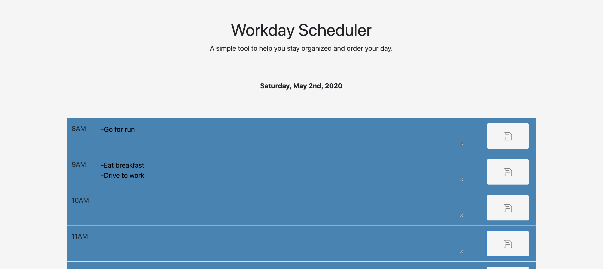
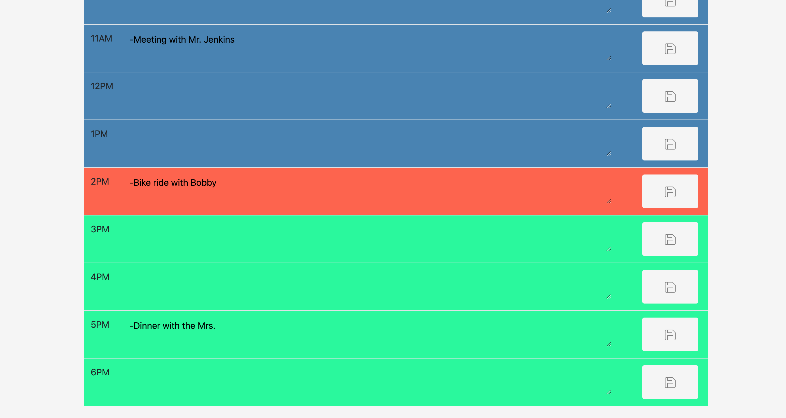

# Hourly Workday Calendar
I created an hourly workday calendar which saves todo items typed into the hours of the day.

The save buttons on the right save the text to local storage when clicked so the text will be there when the user visits the page again later.

The hour sections of the calendar also change colors depending on the time of day. Red is for the current hour; green is for future hours; and gray-blue is for past hours. Similarly, the weekday and date at the top of the page update automatically.

## Deployed Site
[Here is the link](https://tribeofbenjamin.github.io/Hourly-Workday-Calendar/) to the deployed site.

## Images
#1:

#2:

